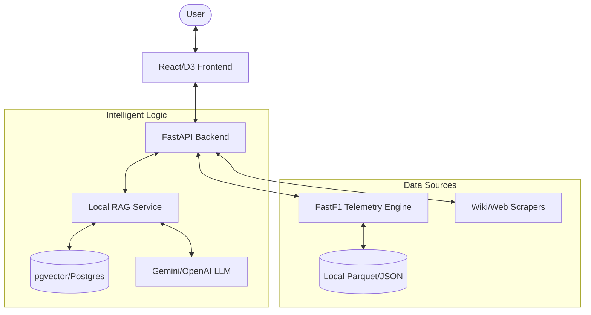
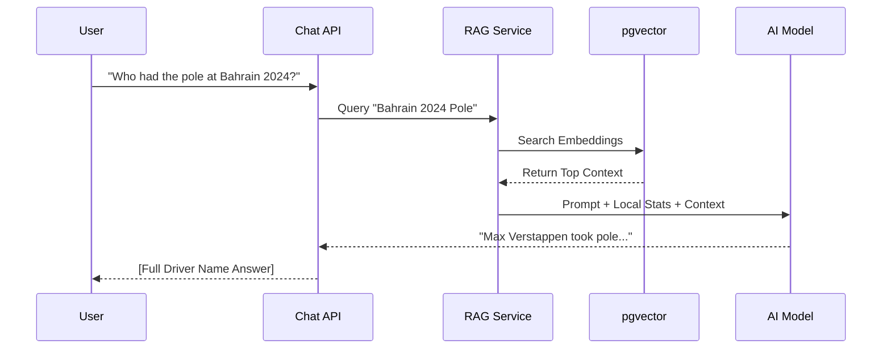

# F1 Race Intelligence Platform 🏎️💨

A high-performance race visualization and intelligence platform that combines **FastF1 telemetry**, **LLM-powered RAG insights**, and **3D track animation**.

## 🌟 Key Features

- **3D Track Visualization**: Interactive race track with real-time car positioning and lap-by-lap playback.
- **AI Pit Crew**: A RAG-powered chatbot that analyzes driver performance, race strategy, and historical data.
- **Telemetry Analytics**: Real-time charts for speed, throttle, brake, and gear usage.
- **Dynamic Insights**: Automatically generated race highlights and strategy summaries.
- **Video Integration**: Synchronized YouTube race highlights with telemetry playback.

---

## 🏗️ System Architecture

The project follows a modern decoupled architecture with a FastAPI backend and a React frontend.



---

## 🛠️ Data Ingestion & RAG Workflow

The system uses a sophisticated pipeline to turn raw telemetry and text into actionable insights.



---

## 📁 Project Structure

### Backend (`/src/backend`)
- **`routers/`**: FastAPI endpoints (Session, Track, Chat, Ingest).
- **`services/`**: Core logic providers.
  - `fetcher.py`: Manages FastF1 data loading and caching.
  - `laps.py`: Processes raw telemetry into discrete lap summaries.
  - `local_rag.py`: Orchestrates local search and LLM context injection.
  - `video.py`: Handles YouTube synchronization.

### Frontend (`/src/frontend`)
- **`components/`**: Modular UI elements (Bento Grid, Highlight Cards).
- **`components/track/`**: 3D Track logic and car layer animations.
- **`store/`**: Zustand state management for telemetry playback.

---

## 🚀 Getting Started

### Prerequisites
- Docker & Docker Compose
- API Keys: `GEMINI_API_KEY` (or `OPENAI_API_KEY`)

### Quick Start (Docker)
1. **Configure Environment**:
   Create a `.env` file in the root:
   ```env
   OPENAI_API_KEY=your_key_here
   GEMINI_API_KEY=your_key_here
   ```

2. **Launch Services**:
   ```bash
   docker-compose up --build
   ```
   The platform will be available at `http://localhost:3000`.

### Local Development
**Backend**:
```bash
pip install -r requirements.txt
uvicorn src.backend.app:app --reload
```

**Frontend**:
```bash
cd src/frontend
npm install
npm run dev
```

---

## 📊 Core Functions & Utilities

### Driver Normalization
The system employs a global mapping utility (`_DRIVER_CODE_MAPPING`) to ensure that all internal three-letter codes (e.g., `VER`) are resolved to professional full names (e.g., `Max Verstappen`) in all AI responses and UI labels.

### Session Sync
Telemetry data is resampled to a consistent 10Hz frequency to ensure smooth 3D animations and precise synchronization with video playback timestamps.

---

## ✨ Credits
- **Data**: Powered by [FastF1](https://github.com/theOehrly/FastF1)
- **Intelligence**: Google Gemini / OpenAI
- **Visualization**: React, D3.js, Lucide Icons
