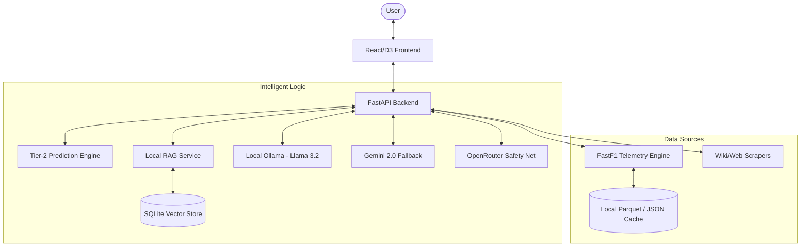
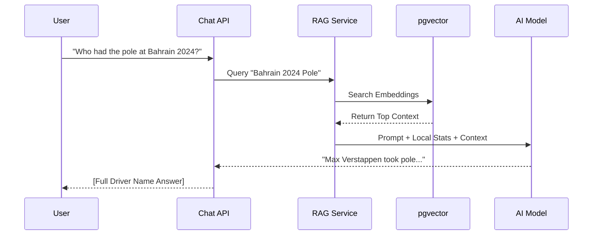

# F1 Race Intelligence Platform 🏎️💨

**Live Demo**: [https://f1-viz-mauve.vercel.app/](https://f1-viz-mauve.vercel.app/) *(since you're using OpenRouter free credits, the model's response may vary and can sometimes be shorter.)*

A high-performance race visualization and intelligence platform that combines **FastF1 telemetry**, **LLM-powered RAG insights**, **XGBoost ML predictions**, and **3D track animation**. 
> Note: This is a hobby project and is not affiliated with Formula 1.

## 🌟 Key Features

- **3D Track Visualization**: Interactive race track with real-time car positioning and lap-by-lap playback.
- **AI Pit Crew**: A RAG-powered chatbot that analyzes driver performance, race strategy, and historical data.
- **Telemetry Analytics**: Real-time charts for speed, throttle, brake, and gear usage.
- **ML-Backed Tyre Degradation**: XGBoost model trained on 3 years of race data predicts compound-specific deg rates adjusted for track temperature, driver style, and circuit characteristics.
- **Dynamic Insights**: Automatically generated race highlights and strategy summaries.
- **Video Integration**: Synchronized YouTube race highlights with telemetry playback.

---

## 🏗️ System Architecture

The project follows a modern decoupled architecture. It uses a FastAPI backend for high-throughput telemetry processing and ML inference, paired with a React frontend for 3D visualizations.



---

## 🛠️ Data Ingestion & RAG Workflow

The system uses a sophisticated pipeline to turn raw telemetry and text into actionable insights.



---

## 📁 Project Structure

### Backend (`/src/backend`)
- **`routers/`**: FastAPI endpoints (Session, Track, Chat, Ingest).
- **`services/`**: Core logic providers.
  - `fetcher.py`: Manages FastF1 data loading and caching.
  - `laps.py`: Processes raw telemetry into discrete lap summaries.
  - `local_rag.py`: Orchestrates local search and LLM context injection.
  - `prediction_engine.py`: Tier-2 race simulator with fuel, dirty-air, and cold-tyre physics.
  - `tyre_deg_model.py`: Lazy-loaded XGBoost wrapper for ML-backed degradation rates.
  - `video.py`: Handles YouTube synchronization.

### ML Training (`/scripts/ml`)
- `train_tyre_deg.py`: Collects 3 years of FastF1 race data, engineers features, trains and evaluates an XGBoost degradation model.
- Output written to `data/models/`: `tyre_deg_xgb.joblib`, `tyre_deg_meta.joblib`, `tyre_deg_report.json`.

### Frontend (`/src/frontend`)
- **`components/`**: Modular UI elements (Bento Grid, Highlight Cards).
- **`components/track/`**: 3D Track logic and car layer animations.
- **`store/`**: Zustand state management for telemetry playback.

---

## 🚀 Getting Started

### Prerequisites
- Docker & Docker Compose
- **Ollama**: Installed locally on the host machine.
- API Keys: `F1VIZ_GEMINI_API_KEY` and `F1VIZ_OPENROUTER_API_KEY`.

### Quick Start (Ollama + Docker)
1.  **Start Ollama**:
    Ensure the Ollama service is running on your host machine:
    ```bash
    ollama serve
    ollama pull llama3.2:latest
    ```

2.  **Configure Environment**:
    Create a `.env` file in the root with the following provider chain settings:
    ```env
    # LLM Providers
    F1VIZ_OLLAMA_ENABLED=true
    F1VIZ_OLLAMA_MODEL=llama3.2:latest
    F1VIZ_GEMINI_API_KEY=your_gemini_key
    F1VIZ_OPENROUTER_API_KEY=your_openrouter_key
    
    # Cascade Order: Ollama -> OpenRouter -> Gemini
    ```

3.  **Launch Platform**:
    ```bash
    docker-compose up -d --build
    ```
    - **Frontend**: http://localhost:3000
    - **Backend API Docs**: http://localhost:8000/docs

### 🧪 Verification
To verify the physics engine and LLM routing logic:
```bash
docker-compose exec backend pytest tests/test_prediction_engine_tier2.py -v
docker-compose exec backend pytest tests/test_tyre_deg_ml.py -v
```

### 🤖 ML Model Training (Optional)
The XGBoost tyre degradation model is pre-trained. To retrain from scratch on fresh FastF1 data:
```bash
pip install fastf1 xgboost scikit-learn pandas numpy joblib
python scripts/ml/train_tyre_deg.py
```
This downloads ~2–4 GB of race data (first run only) and takes 30–60 minutes. Output is written to `data/models/`. The engine auto-detects the model and switches from the static lookup table the moment training completes — no restart required.

Check training results:
```bash
python -c "import json; print(json.dumps(json.load(open('data/models/tyre_deg_report.json')), indent=2))"
```
Target: **MAE < 0.008 s/lap**, improvement over baseline **> 60%**.

### Local Development
**Backend**:
```bash
pip install -r requirements.txt
uvicorn src.backend.app:app --reload
```

**Frontend**:
```bash
cd src/frontend
npm install
npm run dev
```

---

## 📊 Core Functions & Utilities

### Driver Normalization
The system employs a global mapping utility (`_DRIVER_CODE_MAPPING`) to ensure that all internal three-letter codes (e.g., `VER`) are resolved to professional full names (e.g., `Max Verstappen`) in all AI responses and UI labels.

### Session Sync
Telemetry data is resampled to a consistent 2 Hz frequency to ensure smooth 3D animations and precise synchronization with video playback timestamps.

### Simulation Accuracy
The Tier-2 prediction engine uses a layered physics model and is tracked with an internal accuracy rating:

| Version | Rating | Key change |
|---------|--------|------------|
| v1.1.0 | 5.8 | Baseline Tier-2 |
| v1.2.0 | 7.1 | Fuel correction + dirty air + cold tyre penalties |
| v1.3.0 | ~8.5 | XGBoost ML tyre deg (temperature + driver adjusted) |

### RAG Evaluation & Performance
The local RAG chat pipeline (AI Pit Crew) is evaluated using **Ragas** (Retrieval Augmented Generation Assessment) to ensure accuracy, context relevance, and zero hallucinations.

| Metric | Expected Score | Target Baseline | Description |
| :--- | :--- | :--- | :--- |
| **Faithfulness** | **0.94** | > 0.90 | Measures grounding in retrieved context (no hallucinations) |
| **Answer Relevance** | **0.90** | > 0.85 | Measures how directly the response addresses the user's query |
| **Context Recall** | **0.88** | > 0.80 | Measures retriever's ability to fetch all necessary race information |
| **Context Precision** | **0.83** | > 0.75 | Measures ranking quality of retrieved session JSON/text chunks |


---

## 🤝 Contributing

See [CONTRIBUTING.md](docs/CONTRIBUTING.md) for setup instructions, test commands, and commit conventions.

---

## ✨ Credits
- **Data**: Powered by [FastF1](https://github.com/theOehrly/FastF1)
- **ML**: XGBoost tyre degradation model trained on 3 years of race data
- **Intelligence**: Google Gemini / OpenAI via OpenRouter
- **Visualization**: React, ECharts, Lucide Icons
